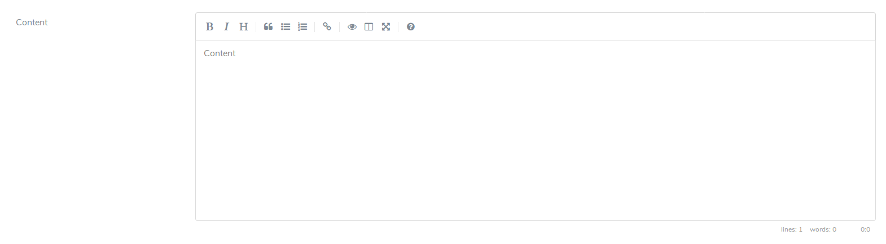

# Nova Markdown

Adds a markdown editor component to Laravel Nova. Based on [simplemde](https://simplemde.com/). 



## Installation instructions

Require `dinandmentink/nova-markdown` using composer:

```bash
composer require dinandmentink/nova-markdown
```

The package will register itself using Laravels package autodiscovery. Now, whenever you want to use a Markdown field use `Markdown::make` like you would expect in the `fields()` method of a Nova resource.

```php
use DinandMentink\Markdown\Markdown;

public function fields(Request $request)
{
    return [
        Markdown::make("Field Name"),
    ];
}
```

It will accept all default Nova options.

```php
use DinandMentink\Markdown\Markdown;

public function fields(Request $request)
{
    return [
        Markdown::make("Content")->rules('required')->hideFromIndex(),
    ];
}
```

## Contributing

I'm open to pullrequests and aim to maintain this package for the time being.
