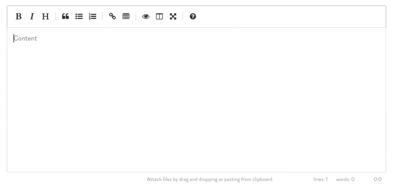

# EOL Notice

**Laravel v10 will be the latest version supported by this package**

This is a friendly upfront notice that this project will stop receiving maintenance with laravel v11. Since Laravel Nova switched to a yearly fee last year I have looked around for a good alternative. I have decided to migrate all my personal projects and customers to [filament](https://filamentphp.com/). 

I'm trying to EOL this project in a responsible manner that I can commit to. Please reach out if you have any suggestions or concerns.

- I will ensure this package keeps working with laravel v10 and nova v4.
- Pull requests will be reviewed and accepted for the time being, including updates which will keep it working with future Laravel / Nova versions. I will however not be performing these updates myself.
- If you would like to maintain a successor of this project please make a fork and reach out to me. 
- When Laravel v11 or Nova v5 drops I will mark this project as abandoned and suggest an alternative. Which will either be a maintained fork (preferably) or [Spatie Filament Markdown Editor](https://github.com/spatie/filament-markdown-editor) which is the same editor, but for filament.

I have happily maintained this project since 2019. Thanks for the pull requests, suggestions and other help. 

*Sidenote. I'm a bit angry with Laravel Nova switching to a yearly license. Which forced me, as a single-person-agency, to either abandon updates or pay yearly for some 30-ish customers. For my multi-tenant products Laravel Nova became completely unusable due to it's license. I highly recommend checking out filament as an open-source alternative.*

# Nova Markdown
[](https://packagist.org/packages/dinandmentink/nova-markdown)
[](https://packagist.org/packages/dinandmentink/nova-markdown)


Add a markdown editor field to Laravel Nova. Based on [easymde](https://github.com/Ionaru/easy-markdown-editor), Nova Markdown supports highlighting, some useful buttons and inline image uploads. It's simple, configurable, and it just works™.



## Installation instructions
Require `dinandmentink/nova-markdown` using composer:

```bash
composer require dinandmentink/nova-markdown
```

The package will register itself using Laravels' package autodiscovery. Now, whenever you want to use a Markdown field use `Markdown::make` like you would expect in the `fields()` method of a Nova resource.

```php
use DinandMentink\Markdown\Markdown;

public function fields(Request $request)
{
    return [
        Markdown::make("Field Name"),
    ];
}
```

It will accept all default Nova options:

```php
use DinandMentink\Markdown\Markdown;

public function fields(Request $request)
{
    return [
        Markdown::make("Content")->rules('required')->hideFromIndex(),
    ];
}
```

Nova Markdown uses [nova-packages-tool](https://github.com/nova-kit/nova-packages-tool) to provide a versioned `laravel-nova` mixin. Please ensure you have `@php artisan nova:publish` in your composer's `script.post-update-cmd` to [keep nova's assets updated](https://nova.laravel.com/docs/4.0/installation.html#keeping-nova-s-assets-updated).

## Versioning
Nova Markdown uses [semantic versioning](https://semver.org/) and aims to always support the latest major Laravel and Laravel Nova release. 

Only the latest major version for Nova Markdown will receive updates, it is recommended to upgrade to the latest version of Nova Markown whenever a new major version for Laravel or Laravel Nova drops. 

| Nova Markdown | Laravel | Laravel Nova | Maintenance              |
|:--------------|:--------|:-------------|:-------------------------|
| v5.x          | v10.x   | v4.x         | Features, Security, Bugs |
| v4.x          | v9.x    | v4.x         | Security                 |
| v3.x          | v9.x    | v3.x         | None                     |
| v2.x          | v8.x    | v3.x         | None                     |

## Image uploads
Nova Markdown supports inline image uploads. To upload an image you can drag-and-drop it onto the markdown editor. Alternatively, pasting an image from your clipboard will also work. 

Image upload is enabled by default for all `Markdown` fields. It can be disabled entirely, or by default, through the config. Image upload can be enabled or disabled on a per-field basis, but this will *only* toggle the frontend implementation of image uploads. 

```php
use DinandMentink\Markdown\Markdown;

public function fields(Request $request)
{
    return [
        Markdown::make("Field With Uploads")->uploads(),
        Markdown::make("Field Without Uploads")->uploads(false),
    ];
}
```

Image upload should just work™. Nova Markdown aims to support image uploads on a vanilla laravel + nova project. The following assumptions must be met. It's possible to override most of these through the config.

- A disk named `public` is assumed to be configured in `filesystems.php`.
- Nova Markdown uses [spatie/image](https://github.com/spatie/image) for compressing and resizing images. Image requires the php [exif extension](http://php.net/manual/en/exif.installation.php) to be enabled.
- Nova Markdown registers a route and a controller in the same middleware configured in `nova.middleware`. This assumes an authenticated user that may access Nova may also upload images through Nova Markdown's image upload route.

## Config
Config mainly deals with image uploads. Sensible defaults are provided, but Nova Markdown aims to be fully configurable either through `config/nova-markdown.php` or env variables.  

For all configuration options please see the [default config](src/config/nova-markdown.php), which can be published:

```bash
php artisan vendor:publish --provider="DinandMentink\Markdown\FieldServiceProvider"
```

This will create a `config/nova-markdown.php` file in your app that you can modify to set your configuration. Please make sure you check for changes to the original config file in this package between releases. The following are some of the most usefull config items.

**Enable uploads**

Config key: `uploads`  
ENV: `NOVA_MARKDOWN_UPLOADS`  
Default: `true`

Setting this to `false` will disable image uploads completely.

**Enable uploads by default** 

Config key: `uploads-default-enabled`  
ENV: `NOVA_MARKDOWN_UPLOADS_DEFAULT_ENABLED`  
Default: `true`

Will enable uploads by default (to be enabled on a per-field basis). Has no effect when uploads are disabled entirely. 

**Set disk**

Config key: `disk`  
ENV: `NOVA_MARKDOWN_DISK`  
Default: `public`

Set the disk where uploads are stored. Must be configured in `filesystems.php`. Note that Nova Markdown stores files with [visibility public](https://laravel.com/docs/filesystem#file-visibility) by default. This might override a disks' default private setting (`'visibility' => 'private'`) on a per-file basis.

**File visibility**

Config key: `file-visibility`  
ENV: `NOVA_MARKDOWN_FILE_VISIBILITY`  
Default: `public`

Uploaded files will receive this as their visibility after uploading. Change to `'private'` to set files as not publicly visible or `null` to default to the disk's default. Note however that uploading files as `private` may disallow visitors from viewing them and you may have to introduce alternative means of displaying the files.

**Directory**

Config key: `directory`  
ENV: `NOVA_MARKDOWN_DIRECTORY`  
Default: `uploads`

Set the directory where images are uploaded. Alternatively, it's possible to configure a function, which takes the uploading $user as argument and can be used to group files by user. Example:

```php
function($user) { 
    return "uploads/" . \Str::slug($user->name); 
}
```

**Maximum upload size**

Config key: `max-size`  
ENV: `NOVA_MARKDOWN_MAX_SIZE`  
Default: `8 * 1024`

The maximum size for uploaded images in kilobytes.

**Maximum upload width**

Config key: `max-width`  
ENV: `NOVA_MARKDOWN_MAX_WIDTH`  
Default: `1920`

The maximum width for uploaded images in pixels. Uploaded images will be scaled down to this width. Use null to disable image scaling.

**Image Quality**

Config key: `quality`  
ENV: `NOVA_MARKDOWN_QUALITY`  
Default: `85`

Uploaded images will be converted to this quality. Integer between 0 and 100. Use `null` to disable quality adjustments.

**Random Filename**

Config key: `random_filename`  
ENV: `NOVA_MARKDOWN_RANDOM_FILENAME`  
Default: `false`

Uploaded images will be stored by default using a slug version of its original filename. You can set this to true to use a random filename instead.

## Security
If you discover any security related issues, please email [dinand@dcreative.nl](mailto:dinand@dcreative.nl) instead of using the issue tracker.

## Rendering markdown
Nova Markdown will add a markdown editor field to Nova. It does not render markdown outside Nova. For rendering the markdown in Laravel views I recommend having a look at [Laravel Markdown](https://github.com/GrahamCampbell/Laravel-Markdown) or [commonmark](https://github.com/thephpleague/commonmark).

## Difference with Nova's own markdown
Nova, ofcourse, offers it's own [markdown field](https://nova.laravel.com/docs/1.0/resources/fields.html#markdown-field). Nova's official markdown and this, Nova Markdown, are similar. Both of them offer inline text highlighting of markdown text. Neither of them perform transformations on the input and simply store it as plain text, usually in a TEXT column. 

This package however will add some more highlighting and toolbar buttons that are not included the default Markdown field. But mainly, **Nova Markdown handles image uploads**. 

| Functionality | Default Markdown | Nova Markdown |
| --- | --- | --- |
| Strong | V | V |
| Italic | V | V |
| External image | V | V |
| Link | V | V |
| Preview | V | V |
| Inline image upload | - | V |
| Headings | - | V |
| Blockquotes | - | V |
| Ordered lists | - | V |
| Unordered lists | - | V |
| Side-by-side view | - | V |

## Credits
This project was proudly created and maintained by [Dcreative](https://www.dcreative.nl) since 2019. Dcreative is a tiny webdevelopmment agency in the Netherlands. 

After Laravel Nova changed their license to a yearly fee Dcreative decided to switch to [filament](https://filamentphp.com/) as an admin panel and therefor no longer actively maintain this project.
